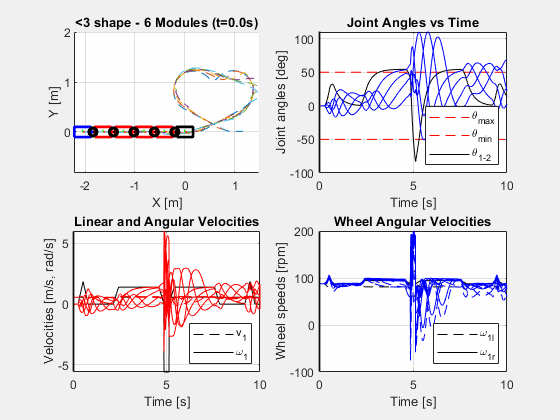

# AGEVAR - Multi-Module Robot Kinematics Simulation

## Slip-Control Branch

**File**: `agevar.m`

**Purpose**: Advanced slip control and constraint-based positioning algorithms.

**Features**: 
- Sequential pivot maneuvers with constraint-based control
- Constraint satisfaction for inter-module connections
- Real-time constraint error monitoring and debugging
- Advanced kinematics for complex multi-module coordination

**Technical Details**: 
- Constraint-based positioning for pivoting modules
- Geometric constraint satisfaction between module connections
- Velocity coordination maintaining realistic forward movement
- Debug output for constraint errors and velocities

## Other Branches

- **main**: Development and testing version with trajectory simulation
- **demo-loop**: Continuous demo version for presentations
- **pivot**: Basic sequential pivot maneuver simulation

